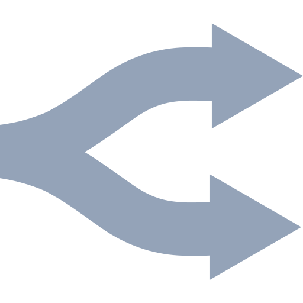
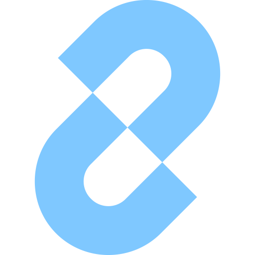
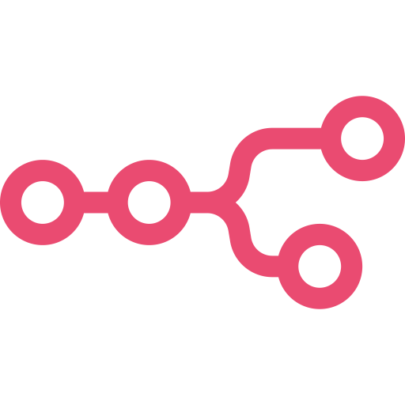
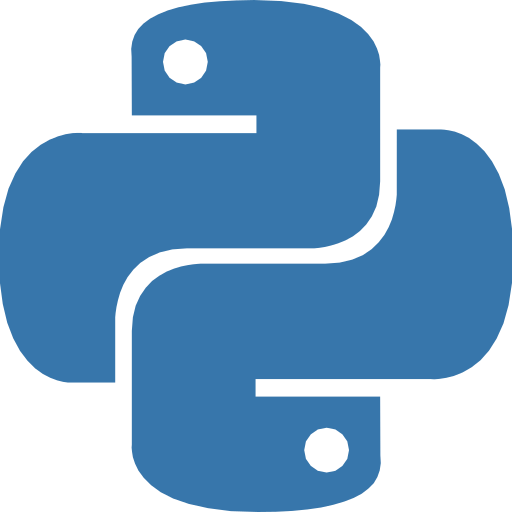
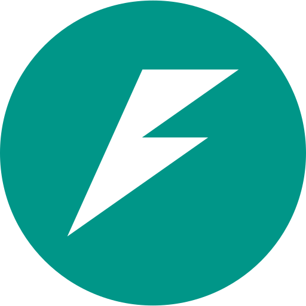
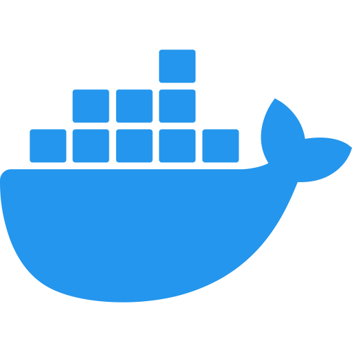
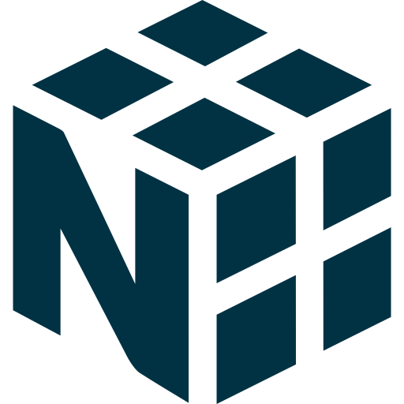
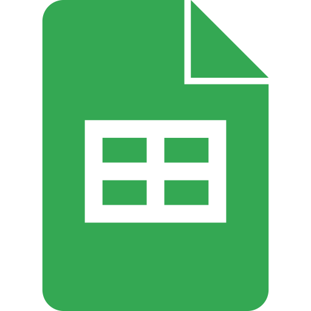
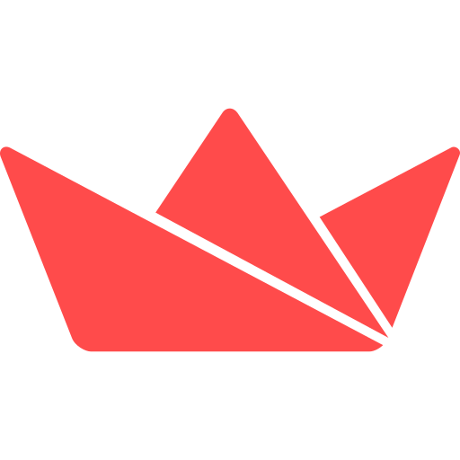
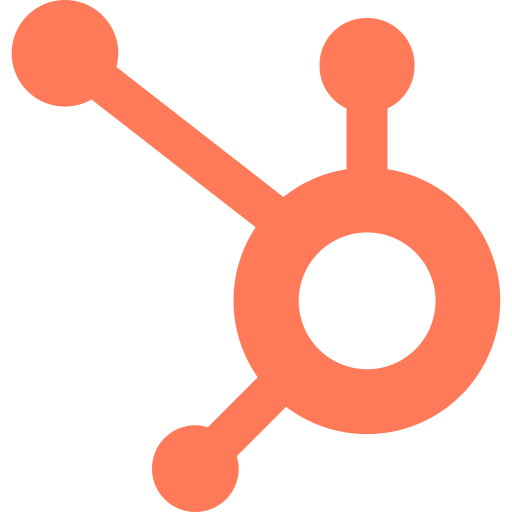

# Hussain Murtaza Ali
### AI Engineer · Automation Architect · Karachi, Pakistan

---

I engineer AI systems that ship to production — voice agents, multi-agent automation pipelines, LLM-powered products, and data platforms. Working at the intersection of applied AI, workflow automation, and measurable business outcomes under **[Nubis Systems](https://hussain.nubissystems.com)**.

- Building agentic systems and LLM-powered products for real clients
- Production deployments across restaurant tech, HR, healthcare, and enterprise
- Data engineering with field-level rigor — 30,000+ GPS-tagged records, WHO-grade pipelines
- BS Computer Science @ Iqra University (2027) · Atomcamp AI Bootcamp Alumni

---

## Tech Stack

### AI Agents & LLM Platforms

 &nbsp;&nbsp; &nbsp;&nbsp; &nbsp;&nbsp; &nbsp;&nbsp; &nbsp;&nbsp; &nbsp;&nbsp; &nbsp;&nbsp;  

### Voice AI & Automation

 &nbsp;&nbsp; &nbsp;&nbsp; &nbsp;&nbsp; &nbsp;&nbsp; &nbsp;&nbsp;  

### Backend & Infrastructure

 &nbsp;&nbsp; &nbsp;&nbsp; &nbsp;&nbsp; &nbsp;&nbsp; &nbsp;&nbsp;  

### Data & Analytics

 &nbsp;&nbsp; &nbsp;&nbsp; &nbsp;&nbsp; &nbsp;&nbsp;  

### Ops & CRM Tooling

 &nbsp;&nbsp;  

---

## Production Systems

> Deployed, live, and serving real users. Not demos.

**Clovey — Restaurant Voice AI**
Real-time voice receptionist handling inbound calls, menu queries, POS orders, and reservations. Live in New York.
`Twilio` · `Square POS API` · `n8n` · `LLM Orchestration`

---

**Ruwaad AI — HR Interview Agent**
Avatar-based AI interviewer with a custom LLM backend integrated into the client's existing HR infrastructure.
`Beyond Presence` · `Python` · `n8n` · `Supabase`

---

**Multi-Agent Email Outreach System**
End-to-end automated cold outreach pipeline. **886 brands contacted · 14.8% reply rate.**
`n8n` · `LLM Personalization`

---

**AI Lead Generation Pipeline**
9-stage pipeline replacing 3–4 hours of daily manual research. **1,000+ leads · 5,000+ reviews analyzed.**
`n8n` · `Google Gemini` · `Google Maps API`

---

**WHO Polio Eradication Initiative — Sindh, Pakistan**
Data governance pipeline for 30,000+ GPS-tagged field records. **30% accuracy improvement · 25% fewer quality issues.**
`Python` · `Power BI` · `Data Governance`

---

**Badri Consultancy — Internal AI Chatbot**
Employee handbook bot deployed in a secure self-hosted data center with MS Teams integration.
`n8n` · `Azure Bot Service` · `Cloud LLM`

---

## Open Source

| Project | Description | Stack |
|---|---|---|
| [Text Classification API](https://github.com/HussainM899/text-classification-FastAPI-Docker-HF) | REST API for multilingual sentiment and emotion classification | FastAPI · Docker · HuggingFace |
| [COVID-19 Sentiment Analysis](https://github.com/HussainM899/Covid-Sentiment-Analysis-NLP) | Twitter NLP pipeline — LDA topic modeling and sentiment analysis | Python · NLTK · Gensim |
| [YOLOv8 Object Detection](https://github.com/HussainM899/Object-Detection-using-YOLOV8) | Real-time object detection on images and video | PyTorch · OpenCV |
| [Pothole Detection](https://github.com/HussainM899/Pothole-Detection-using-YOLOV8) | Custom-trained YOLOv8 for real-time urban road pothole detection | PyTorch · OpenCV |
| [BedAlert — Hospital Capacity AI](https://github.com/HussainM899/Team-Nubis-BedAlert-AI-Hackathon) | Multi-agent hospital capacity system for disaster scenarios. 4 ADK agents, real-time dashboard | Google ADK · Supabase · React |

---

  <i>Open to collaborations, consulting, and conversations about production AI.</i>  
  <b>hussain@nubissystems.com</b>

